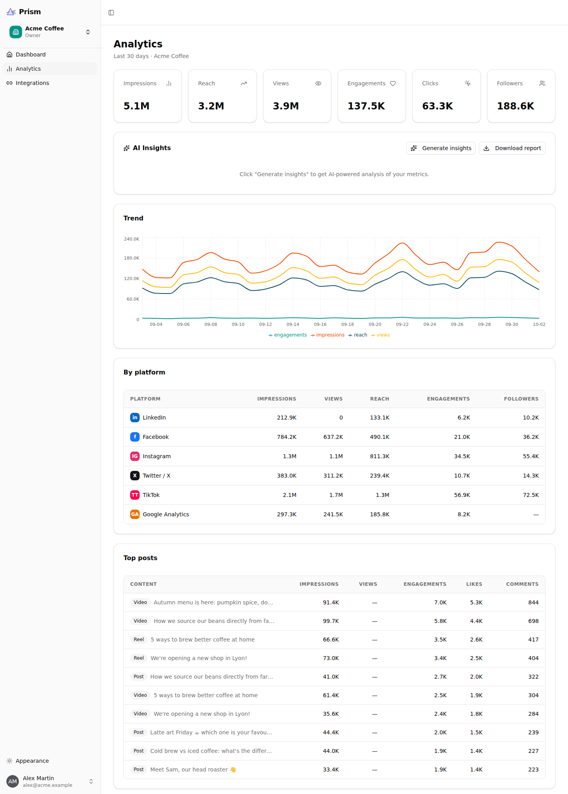
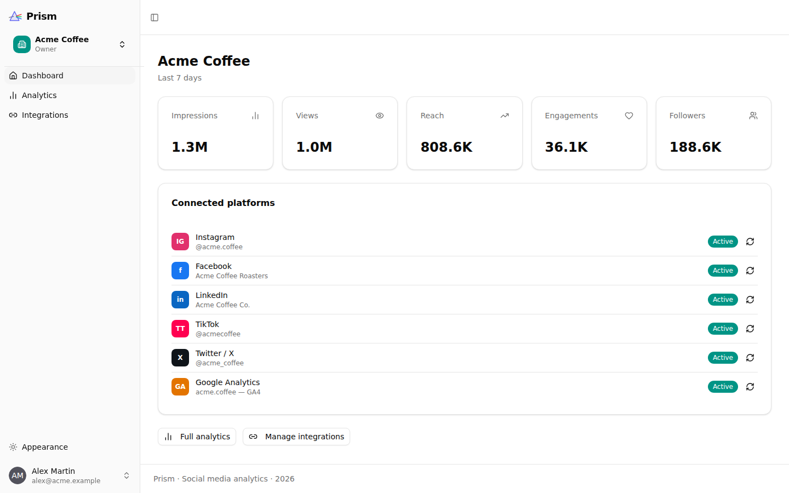
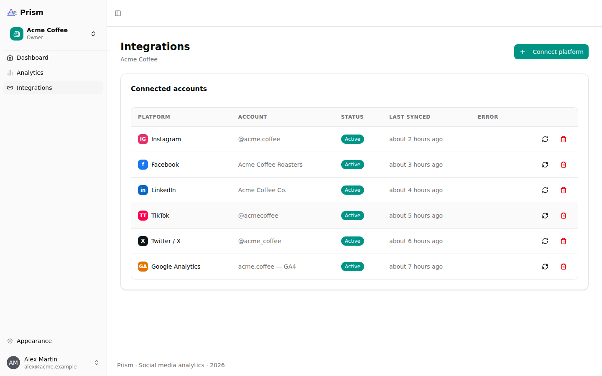
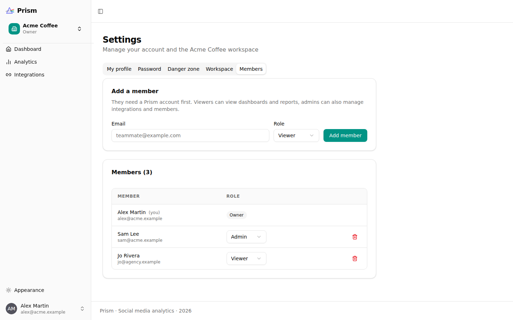

<p align="center">
  
</p>

<p align="center">
  Social media analytics for teams: connect your brand's accounts once and
  get one dashboard, AI insights and performance reports across every platform.
</p>

<p align="center">
  <a href="https://github.com/TheoGoudout/prism/actions/workflows/test-backend.yml"></a>
  <a href="https://github.com/TheoGoudout/prism/actions/workflows/playwright.yml"></a>
  <a href="LICENSE"></a>
</p>



## Features

- **Workspaces**: group integrations per brand or client. Members have a
  role: **owner** (full control), **admin** (manage integrations and
  members) or **viewer** (read-only). Add teammates by email from
  *Settings → Members*.
- **Integrations** via OAuth 2.0:
  - Facebook Pages
  - Instagram Business
  - Twitter / X
  - LinkedIn Company Pages
  - TikTok
  - Google Analytics 4
- **Nightly sync**: a Celery worker pulls each account's daily metrics
  (followers, reach, views or impressions, engagements) and per-post metrics
  into a normalised schema. A sync also runs right after you connect an
  account, and you can trigger one manually.
- **Token lifecycle**: OAuth tokens are encrypted at rest and refreshed
  before they expire. Accounts that can no longer be refreshed are marked
  *expired*, with a one-click **Reconnect**.
- **Dashboards**: KPI totals, daily time series, per-platform breakdown and
  top posts for any date range.
- **Post performance**: for each platform that publishes posts, the latest
  posts with every metric (engagements, engagement rate, likes, comments…)
  ranked against the last 12 months of posts and compared with the best
  (P95), median and worst (P5) posts, plus a chart of every post over time.
- **AI insights and reports** (LangChain): actionable insights and a full
  markdown performance report generated from your metrics. Works with
  OpenAI, Anthropic or Google models.

| Dashboard | Integrations | Members |
|:-:|:-:|:-:|
|  |  |  |

## Stack

| Layer    | Technology |
|----------|------------|
| Backend  | Python 3.14, FastAPI, SQLModel, PostgreSQL, Alembic, Celery, Redis, LangChain |
| Frontend | React 19, TypeScript, Vite, TanStack Router & Query, Tailwind CSS, shadcn/ui, Recharts |
| Tooling  | uv, Ruff, mypy (strict), pytest, Bun, Biome, Playwright |
| Infra    | Docker Compose, Traefik, GitHub Actions |

```
backend/app/
├── api/routes/          # REST endpoints; workspace data lives under /workspaces/{id}/…
├── integrations/
│   ├── oauth/           # one OAuth provider per platform + registry
│   ├── platforms/       # one sync module per platform
│   └── tokens.py        # refresh-before-expiry logic
├── services/metrics.py  # metrics aggregation shared by dashboards and AI
├── worker/              # Celery app, sync tasks, nightly Beat schedule
└── ai/                  # LLM factory and insight / report chains
frontend/src/
├── routes/              # pages (dashboard, analytics, posts, integrations, settings, admin)
├── components/          # UI, including Workspaces/ (onboarding, members)
└── client/              # generated API client (do not edit by hand)
```

## Getting started

1. Copy the example settings and adjust them (the variables are described
   below):

   ```bash
   cp .env.example .env
   cp frontend/.env.example frontend/.env
   ```

   The examples work as-is for local development (CI uses them unchanged).
   For any shared deployment, replace every `changethis` value; generate
   secrets with:

   ```bash
   python -c "import secrets; print(secrets.token_urlsafe(32))"
   ```

2. Start the stack:

   ```bash
   docker compose watch
   ```

   This starts:
   - the frontend at <http://localhost:5173>
   - the API at <http://localhost:8000> (interactive docs at `/docs`)
   - Adminer at <http://localhost:8080>
   - MailCatcher at <http://localhost:1080>
   - Postgres, Redis, and the Celery worker and beat

3. Log in with `FIRST_SUPERUSER` / `FIRST_SUPERUSER_PASSWORD` and create
   your first workspace.

See [development.md](./development.md) for running services outside Docker
and the git hooks, the [backend](backend/README.md) and
[frontend](frontend/README.md) guides for their layout, API and tests, and
[deployment.md](./deployment.md) for production.

### Configuration

| Variable | Purpose |
|----------|---------|
| `SECRET_KEY` | Signs JWTs, and derives the keys that encrypt OAuth tokens and OAuth `state`. **Changing it invalidates stored tokens**, so connected accounts must be reconnected. |
| `FIRST_SUPERUSER`, `FIRST_SUPERUSER_PASSWORD` | Initial admin account |
| `POSTGRES_*` | Database connection |
| `REDIS_URL` | Celery broker / result backend |
| `FRONTEND_HOST` | Where users are redirected after OAuth |
| `API_BASE_URL` | Public URL of the API, used to build OAuth redirect URIs (`{API_BASE_URL}/api/v1/oauth/callback/{platform}`) |
| `SMTP_*`, `EMAILS_FROM_EMAIL` | Password-recovery emails |
| `AI_PROVIDER` (`openai` \| `anthropic` \| `google`), `AI_MODEL`, and the matching `OPENAI_API_KEY` / `ANTHROPIC_API_KEY` / `GOOGLE_API_KEY` | AI insights and reports |
| `LANGCHAIN_TRACING_V2`, `LANGCHAIN_API_KEY` | Optional LangSmith tracing |

Platform credentials are optional. Set only the ones you use:

| Platform | Variables | Notes |
|----------|-----------|-------|
| Facebook, Instagram | `FACEBOOK_APP_ID`, `FACEBOOK_APP_SECRET` | One Meta app serves both. Graph API version is pinned in `backend/app/integrations/meta.py`. |
| Twitter / X | `TWITTER_CLIENT_ID`, `TWITTER_CLIENT_SECRET` | OAuth 2.0 with PKCE |
| LinkedIn | `LINKEDIN_CLIENT_ID`, `LINKEDIN_CLIENT_SECRET` | Requires the Community Management API product |
| TikTok | `TIKTOK_CLIENT_KEY`, `TIKTOK_CLIENT_SECRET` | |
| Google Analytics | `GOOGLE_CLIENT_ID`, `GOOGLE_CLIENT_SECRET` | |

In each provider's developer console, register the redirect URI
`{API_BASE_URL}/api/v1/oauth/callback/{platform}`. The `{platform}` value is
one of `facebook`, `instagram`, `twitter`, `linkedin`, `tiktok` or
`google_analytics`.

## Testing and linting

```bash
# Backend (needs Postgres; see development.md)
cd backend
uv run pytest
uv run ruff check app tests && uv run ruff format --check app tests
uv run mypy app

# Frontend
bun run --filter frontend lint
bun run --filter frontend build
cd frontend && bunx playwright test  # end-to-end; needs the stack running
```

The git hooks in `.pre-commit-config.yaml` (run with
[prek](https://prek.j178.dev); install them with `uv run prek install`) run the
same checks plus workflow linting, and run on every pull request.

## Security

- The OAuth `state` parameter is encrypted, authenticated and expires after
  15 minutes. It binds each authorization to the user, workspace and
  platform that started it, and it keeps the PKCE verifier secret.
- OAuth tokens are encrypted at rest (Fernet) and never returned by the API.

To report a vulnerability, see [SECURITY.md](./SECURITY.md).

## License

Prism is built on the
[Full Stack FastAPI Template](https://github.com/fastapi/full-stack-fastapi-template)
(MIT). See [LICENSE](./LICENSE).
